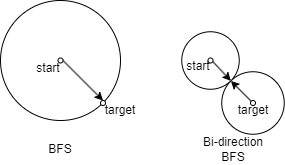

# Ch2

## 简介

### 1. 搜索问题

- 状态空间$S$：问题的所有可能状态的集合。每个状态代表问题中的一个配置或位置。
- 初始状态$s_0$：问题开始时的状态，通常是已知的。
- 目标测试$G(s)$：测试是否到达问题的目标状态，通常是一个布尔值。
- 迁移函数$f$：从一个状态到另一个状态的转换，定义了状态之间的关系。
- 路径成本$c$：从初始状态到目标状态的路径的代价，通常是基于某些标准（如时间、资源等）来衡量的。

通过在解空间中通过不同搜索算法寻找解。

### 2. 搜索状态图

状态空间图（State Space Graph）是描述搜索问题中所有可能状态及其之间转换关系的图结构。每个节点表示一个状态，边表示从一个状态通过某个操作到达另一个状态的转换。在状态空间图中，搜索问题的所有可能解路径都可以通过图的遍历来找到。

### 3. 评估搜索算法的性能

- 完备性：搜索算法能够找到所有可能的解
- 最优性：搜索算法找到的解是最优解
- 时间复杂度：一般情况下最坏的时间开销
- 空间复杂度：一般情况下最坏的空间开销

一般**关注前三点**。请注意**完备性**与**最优性**，如果以前没有了解。可以出题考某一算法的完备性与最优性。

*注：一般情况指问题的结构是一个统计学意义上常出现的结构，最坏的开销指的是在某一个问题结构上所有数据都要参与带来的开销。如快排的时间复杂度是$O(nlogn)$，这是一般情况下所有$n$个数据参与的结果。在不好的情况下，问题的结构可能是数据倒序，退化为$O(n^2)$。*

## BFS

**按层（by level或说by layer）扩展**，优先扩展广度，使用FIFO的队列实现。当边权为定值时保证得到最短路径。

- 完备性：假设状态空间有限，则完备（一般认为是完备的）
- 最优性：当**边权为定值**时才最优（一般认为**无最优性**）
- 时间复杂度：$O(V+E)$，节点加边数量
- 空间复杂度：$O(V)$，节点数量

## DFS

优先扩展深度，只有达到叶节点才回溯。使用FILO的栈实现或者递归实现。

- 完备性：不完备，除非保证没有重复状态被访问即**不成环**（一般认为不完备）
- 最优性：不最优
- 时间复杂度：$O(V+E)$，节点加边数量
- 空间复杂度：$O(h)$，最大深度，最坏时为节点数量V（链表）

## 双向BFS

从终点和起点同时开始进行BFS，交替扩展。用于处理终止状态已知的搜索问题。

完备性、最优性、时间复杂度、空间复杂度基本同BFS。

但在统计意义下，其需要搜索的空间常常只有BFS的一半。

    

## ID-DFS

迭代加深深度优先。对于深度优先的简单改良：**设置一个最大深度**$h$，在到达最大深度时**停止该分支的搜索**，如果所有分支搜索结束时没有得到解，**则将$h$加1**，再次**重复流程**。

完备性、最优性、时间复杂度、空间复杂度基本同DFS。

可以证明ID-DFS在二叉树上搜索的节点数不会超过BFS搜索结果的两倍。在统计意义下，搜索的空间显著小于传统DFS。

对于二叉树，若结果在第$l$层，BFS需要搜索约$2^l$个节点，而ID-DFS约有：
$$ 2^0 + 2^1 + \cdots + 2^l = 2^{l+1} - 1 < 2 \times 2^l$$