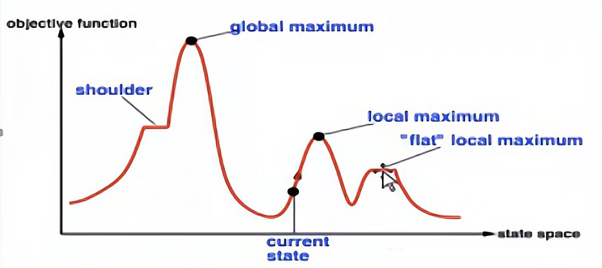
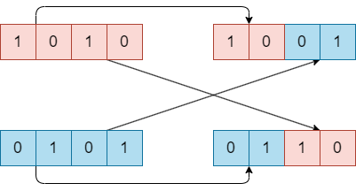

# Ch4

## 局部搜索

局部搜索，或随机搜索算法是一类不记录全局信息，只依靠局部信息进行搜索的算法，具有较大随机性，但可以处理问题空间非常大的问题。一般用于处理**不关心具体路径，只关心结果状态的问题**。

*注：问题依赖于建模方式，例如网格寻路也可以建模为一个随机搜索问题，设在$8 \times 8$的网格$grid[8][8]$搜索路径，将状态定义为一个$64$位的布尔向量$v$，每一位$i$代表在网格的$grid[\lfloor i/8 \rfloor][i \mod 8]$位置是否在答案路径中。状态空间是所有可能的$64$位布尔向量的集合，在该空间下我们不关心搜索的路径，只关心最终的结果状态。虽然这种建模显然是愚蠢的。*

在随机算法中，**最优性往往是不满足的，完备性很多时候没有意义**（解空间趋近无穷大，很多问题难以证明是否真的存在解），但有**概率完备**和**概率最优**，这两部分有时候涉及到随机矩阵、泛函分析等复杂知识，暂不介绍。

注意下图：

<p align="center">
    
</p>

全局最优（global maximum）是我们追求的解。 山肩（shoulder）虽然在全局最优的搜索路径上，却可能因为梯度丢失而阻碍搜索。搜索的过程可能找到局部最优（local maximum），我们要尽力避免陷入局部最优。

## Hill Climbing

爬山法是一种贪心算法。它的基本流程如下：
```
随机选择一个初始点s = s0
Loop:
    评估当前状态是否为目标G(s) == True?
        如果True，返回s
    若没有可选则的邻居状态，返回s
    选择一个邻居状态s' = generate_neighbor(s)
    评估邻居状态更好f(s') < f(s)?
        如果True，s = s'
```

总结来说就是不断循环，**尝试找到周围某个比当前状态更好的状态贪心的更新**。有时我们会在单个循环中同时评估所有邻居取最好的那个。

## Random Restart Hill Climbing

随机重启法是一种改进的爬山法。其思想简单：即在**多个不同的初始状态下多次进行爬山法搜索**，最终返回一个最优解。

随即重启设置一个阈值$T$，**循环$T$次搜索后随机重启，陷入局部最优（多次循环没有更新）也随机重启**。

*注：这种思想在集成学习中也会出现。*

## Simulated Annealing

模拟退火法模拟金属冶炼中的热力学过程，以降温的方式逼近最优解。其基本思想是进行类似于爬山法的搜索，但是不总是要求更新为更优的解，而是以**一定概率更新为一个更差的解**。这个概率随着循环次数增加不断降低（即退火）。
```
随机选择一个初始点s = s0
设置初始温度T
Loop:
    评估当前状态是否为目标G(s) == True?
        如果True，返回s
    若没有可选则的邻居状态，返回s
    选择一个邻居状态s' = generate_neighbor(s)
    评估邻居状态更好f(s') < f(s)?
        如果True，s = s'
    否则
        检查随机数random(0, 1) < probability(T, s, s')?
            如果True，s = s'
    降低温度T = temperature(T)
```
其中概率由以下公式给出：
$$ probability(T, s, s') = e^{-\frac{f(s') - f(s)}{T}}$$
退火公式通常是指数退火：
$$ temperature(T) = \alpha T$$

*注：为保持一致性，我使用了$f(s)$，但在模拟退火法的语境下，常用$E(s)$（表示能量），它的含义和我们说的评估值$f$是一样的。*

重点参数和过程：
- 初始温度$T$
- 状态生成函数
- 概率函数
- 退火公式

*注：以概率接受值的准则叫Metropolis准则，它在Q-learning中也有应用。*

## Genetic Algorithm

遗传算法模拟自然界生物遗传进化的过程。它包含以下过程：
```
编码并生成初始种群p = encode(s)
设置变异率p_m
Loop:
    评估种群中每个个体的适应度f(x) > threshold?
        如果True，返回当前最优个体
    选择优秀个体作为父代种群f = selection(p)
    对父代种群进行交换f = crossover(f)
    变异得到新的子代种群p = mutation(f, p_m)
```

*注：一般返回的个体需要解码$decode(best)$得到原问题的解。*

编码通常使用二进制编码，例如将整型编码为二进制字符串。或者像上面举的网格寻路问题的例子那样。

选择流程常采用锦标赛法或轮盘赌。以轮盘赌为例，其流程是：
- 按照适应度计算每个个体的**选择概率**，这个设计保证概率和为$1$：
$$ p_i = \frac{f_i}{\sum_{j=1}^n f_j}$$
- 从大到小排序，然后计算**累计概率**，即**选择概率的前缀和**：
$$ q_i = \sum_{j=1}^{i} p_j$$
- 进行一步轮盘赌，就是随机在$[0, 1]$之间选择一个数$rand$，如果$q_{i-1} < rand < q_i$则选择第$i$个个体。也就是**在$[0, 1]$随机抽一个数看落在哪个概率区间**。最后一个个体的累计概率保证为$1$。
- 在遗传算法中需要进行$2 \times k$次轮盘赌，保证选择出**偶数个个体**，并且**同一个个体可以选择多次**（被选择多次了就拷贝多个个体出来）。

交叉通常是将选择出的个体两两配对，直接**交换二进制编码的一半数位**。例如$1010$和$0101$交叉后变成$1001$和$0110$。

<p align="center">
    
</p>

*注：如果是奇数长度编码，例如5位二进制编码，可能要求一次交换2位，一次交换3位交替进行。*

变异则是在所有个体的所有二进制位中随机抽取占比$p_m$的位数进行**翻转**。如果有$n$个个体，$m$位编码，那么总共可以变异的位数有$n \times m \times p_m$位。