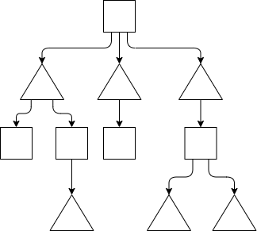
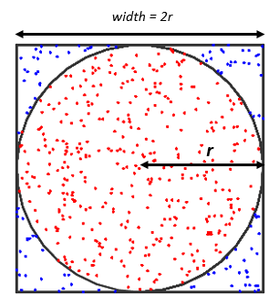
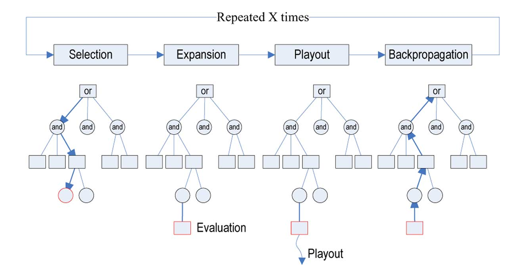

# Ch5

## 博弈树

博弈树仍然是搜索树，只不过按照奇数层高和偶数层高分为**本方节点和对方节点**。例如下图，方框位本方，三角为对方，二者轮流出现。

<p align="center">
    
</p>

哈希表应该不用我讲。

## Minimax Search

### 1. 原理与朴素实现

每个节点都有一个值$v$代表对本方的“奖励”，极大极小值搜索就是本方节点 **（极大节点）选择所有子节点中值最大** 的，对方节点 **（极小节点）选择所有子节点中值最小**的（因此该算法的朴素实现需要某个节点的**所有子节点均完成搜索**才能得到自己的值）。

### 2. Alpha-Beta 剪枝

每个**极大值节点维护它所搜索到的最大值**$alpha$，**极小值节点维护它所搜索到的最小值**$beta$，并且将维护到的值**向下传递**给子节点让它们剪枝。**极大值节点**会收到父节点的$beta$值，当它搜索到**一个值大于$beta$时就不再搜索**了，**极小值节点**会收到父节点的$alpha$值，当它搜索到**一个值小于$alpha$时就不再搜索**了。

原理很好理解：假设我现在是一个极小节点，我已知我的父节点（是一个极大节点）当前搜索到的最大值是$alpha$，那么当我搜索到一个节点的$v_{curr}$值小于等于$alpha$就可以停止搜索并返回了。因为无论怎么搜索，我最终的值$v_{min}$都有$v_{min} \leq v_{curr} \leq alpha$即一定会小于等于$alpha$，我的父节点选择的值$v_{max}$一定会大于等于$alpha$，因此**我已经不可能被选中**。

### 3. Negamax 优化

Negamax负极大值搜索**仅仅是代码实现上的优化**，实现的仍然是极大极小值搜索，它**不带来任何运行上的提升**，相当于一个refactor。

极大极小值搜索的一般实现需要一个`min()`函数和一个`max()`函数，二者交替调用对方实现递归`max(min(max(...)))`，而Negamax只需要一个`negamax`函数即可，它实现的基本功能和`max()`函数是一样的，但是在递归调用时，他会调用`-negamax()`。因为从当前玩家的视角来看，最大化自己的得分等价于最大化对手的得分的相反数。

```python
def negamax(state, depth):
    # do something
    for move in get_legal_moves(state):
        new_state = apply_move(state, move)
        value = -negamax(new_state, depth - 1)  # 递归调用并取反
        best_value = max(best_value, value)
    
    return best_value
```

## MCTS

### 1. 蒙特卡洛方法

蒙特卡洛方法就是进行**大量随机抽样模拟进行统计**的方法。最经典的例子，计算圆的面积：
<p align="center">
    
</p>

随机丢$n$个点进去，已知方形面积为$2 \times r$，则圆面积就是方向面积乘上落在圆内的点$m$比上总共的点数量。
$$ Area = \frac{m}{n} \times 2 \times r $$

### 2. 蒙特卡洛搜索

依旧是树搜索。蒙特卡洛搜索就是进行大量随机抽样，测试每种选择的走向，统计出最利于自己的选择。这个**有利程度用一个$Q$值表示**，它相当于统计意义上的奖励值，**$Q$值越高的节点越好**。

下面的图示比较直观：

<p align="center">
    
</p>

- 选择（Selection）：**选择一个子节点**。选择的策略通常基于UCB启发式探索。
- 展开（Expansion）：如果选择的子节点是一个未被展开的节点，就展开它，即在它下面**添加新的子节点**并加深树。
- 模拟（Playout或者Simulation）：从新扩展的节点出发，进行**随机模拟**，直到达到终局（比如游戏结束或问题求解结束），这个阶段的目的是估计节点的值。
- 反向传播（Backpropagation）：**将模拟的结果反馈给其父节点**，更新所有相关节点的统计信息（如胜率、访问次数等），这样就可以在下次选择时更好地选择子节点。

### 3. Upper Confidence Bound

UCB值被用于选择的过程。我们不希望完全随机的选择节点进行模拟，我们希望：
- 选择的节点比较有希望是**通向较好局面**，我们希望多测试这样的节点。
- 单一节点**不要被测试太多次**，这会导致其他节点访问不够，可能陷入局部最优解。

从父节点$f$到子节点$i$的UCB值定义为:
$$ UCB(i, f) = \frac{Q_i}{N_i} + C \sqrt{\frac{log(N_f)}{N_i}} $$

其中$Q_i$是节点$i$的$Q$值，$N_i$是节点$i$的访问次数，$C$是一个常数，通常取$1.414$或$2$。

式子的前半部分${Q_i}/{N_i}$表示它的好坏程度（节点越好值越大），后面一个和它被访问的频率有关（访问次数越多值越小）。

*注：整个过程和Q Learning很相似。*