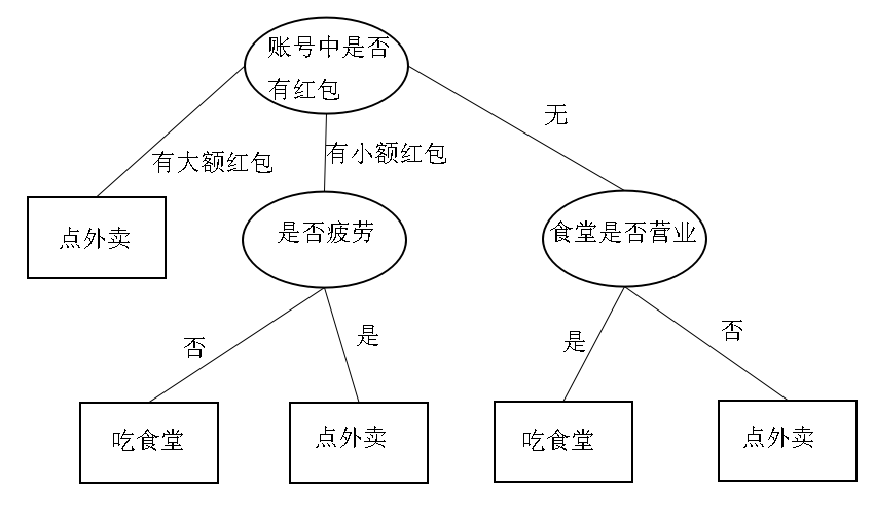
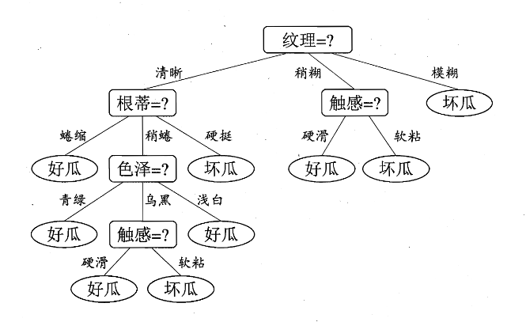
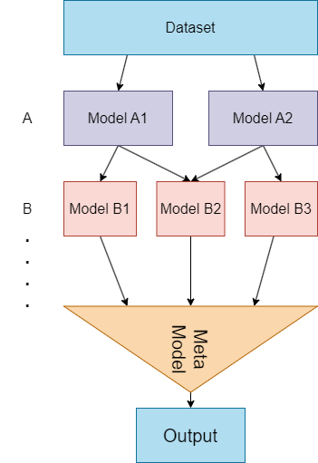

# Ch8

## Decision Tree

决策树是一种分类树，**每一个节点都是一个分类依据**或者说分类标准。就以课件上的图示为例：

<p align="center">
    
</p>

这棵决策树用于做出去哪吃饭的决策。实际运用的决策树大多是做出**某个数据点一个应该被分为哪一类**这样的决策。下面是一个将西瓜分为好瓜和坏瓜的决策树实例。

<p align="center">
    
</p>

对于实际数据集如何分类？从根节点开始，每次选择一个最优划分属性，将数据分为若干子集，再在子集上继续进行划分：
```
generate_tree(数据集D):
    评估数据集D是否需要继续划分should_split(D)？
        如果False，返回
    选择一个划分属性k = select(D)
    Loop 对于该属性的每一种取值a_k：
        为这个取值生成一个新的节点n
        将数据集D中所有属性k为a_k的数据点分给n最为D_n
        对子节点n递归调用generate_tree(D_n)
```

不同决策树算法的不同指出体现在**选择划分属性的方法**不同，即上述的`select(D)`。

### ID3

选择**信息增益**最大的划分属性。

数据集的信息熵定义为（请记住这个公式）：
$$ Ent(D) = - \sum_{i=1}^k \frac{|D_i|}{|D|} log_2 \frac{|D_i|}{|D|} $$

其中$D_i$是第$i$个子集，$|D|$是$D$的数据点个数，$|D_i|$是$D_i$的数据点个数。**二者相比就是子集$i$的数据点数量的占比，可以简称$p_i$**。（简单来说，熵代表混乱程度，数据集里包含的类越多越杂，熵就越大）

信息增益是熵的差值：
$$ Gain(D, a_k) = Ent(D) - \sum_{i=1}^k \frac{|D_i|}{|D|} Ent(D_i) $$

说白了就是**划分前的熵减去划分后的熵，相当于熵的减小值**。熵减小的越多，划分的就越好。ID3就是遍历所有属性计算一次信息增益，选那个使信息增益最大（熵减小的最厉害）的当作划分属性。

### C4.5

选择**信息增益率**最大的的划分属性。

信息增益在一定程度上来说，属性的可选值越多，它天然就越大。信息增益率平衡了这一点：
$$ GainRate(D, a_k) = \frac{Gain(D, a_k)}{Ent(D)} $$

其它操作一致（也是遍历属性计算信息增益率，选那个最大的划分属性）。

### CART

选择**基尼指数**最小的划分属性。

*注，这里是最小！因为基尼系数不好。*

基尼系数你知道，就是那个贫富差距系数嘛。

基尼值：
$$ Gini(D, a_k) = 1 - \sum_{i=1}^k p_i^2 , \quad p_i = \frac{|D_i|}{|D|}$$

它象征随机从$D$里面挑两个数据点，二者不是一个类的概率。

基尼系数：
$$ GiniIndex(D) = \sum_{i=1}^k \frac{|D_i|}{|D|} Gini(D_i)$$

## 集成学习

主要三个：Bagging装袋法，Boosting提升法，Stacking蒸馏法（其实一般叫叠加法或学习法，蒸馏是Distillation，这是个深度学习专有名词，你们老师叫它蒸馏有误用之疑）。

先讲多个模型的集成方法。如果你已经训练了多个模型，你可以：
- 对于回归问题（输出连续数值）**加权平均**，总输出是多个模型输出的线性组合
- 对于分类问题（输出离散类别）选出现最多的那个类，即**投票法**

### Bagging

就是把大训练集分袋，**随机分成互有重叠的若干子训练集**。每个训练集上训练一个弱分类器，最后通过加权或投票集成。

每个模型的训练是**独立**的，没有互相的依赖关系。

### Boosting

**按顺序**训练多个模型，每个模型的训练时**关注前一个模型的判断出错的数据**。有两种方法让模型关注前一个模型的判断出错的数据:
- 重新赋权法。一般对于数据是连续数（即实数）的，可以**为错误数据赋予较大的权重**，为正确数据赋予较小的权重。
- 重采样法。对于无法使用重新赋权法的数据（如离散数据），可以通过**重新采样调整数据集比例**，多采用错误数据，少采用正确数据。

通过加权或投票集成。

### Stacking

分批训练多个模型，每一批模型采用上一批模型的输出作为输入。最后训练一个模型，这个模型接受上一批模型的输出作为输入，得到最终的输出。一批模型可以只有一个。

<p align="center">
    
</p>

### Random Forest

随机森林是Bagging决策树的改进，它只改动了很小的一点：在选取属性时，不从所有属性中挑选最优划分属性，**而是随机抽取$t$个属性，然后从中选取最优划分属性**。

相当于不仅对训练数据集做了Bagging，也**对属性做了Bagging**。

### GBDT

Gradient Boosting Decision Tree，梯度提升决策树，非常强大的算法，现在都还有人再用。对金融数据等效果甚至强于许多深度学习算法。

GBDT按顺序训练一系列模型，第一个模型和普通决策树完全一样，接收数据，尝试拟合真实值，而从第二个模型开始，它并不是去拟合原始的目标值，而是**拟合上一个模型的梯度**。

**梯度就是模型输出和真实值的差值**，相当于$\hat{y} - y$。它是模型预测值与真实值之间的差异，也叫残差。

也就是说，后面每个$i$模型都尝试输出上一个模型的梯度，$y_i = \hat{y_{i-1}} - y_{i-1}$，为了做什么呢？如果它输出足够准确，我们可以通过$y_{i-1} + y_i = y_{i-1} - y_{i-1} + \hat{y_{i-1}} = \hat{y_{i-1}}$来预测真实输出$\hat{y_{i-1}}$。这相当于**拿下一个模型纠正上一个模型**。